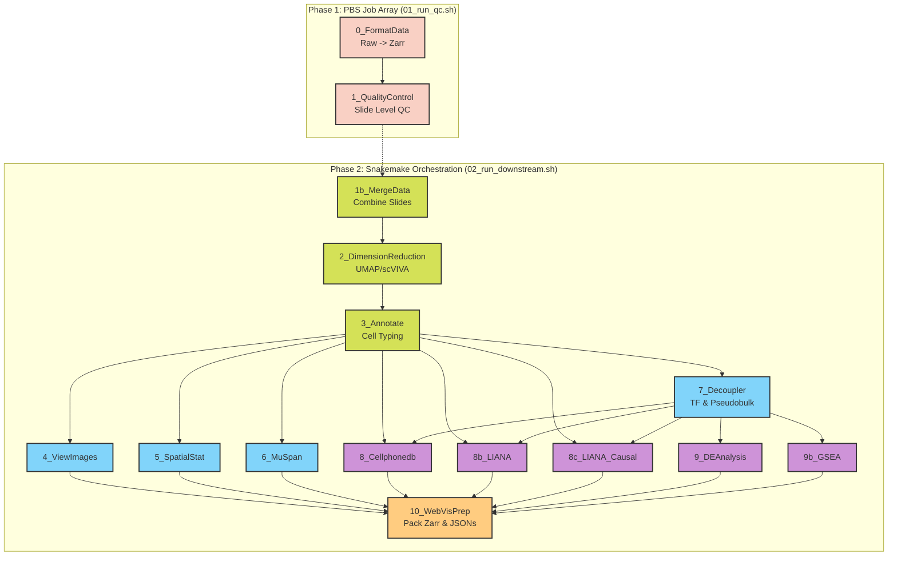

# scSpatial-Kit

An end-to-end Python pipeline for the processing, analysis, and visualization of Spatial Transcriptomics data. Built specifically to handle **NanoString CosMx** and **10x Genomics Xenium** datasets, this pipeline uses modern spatial data frameworks (spatialdata, scanpy, squidpy), advanced spatial statistics (muspan), downstream TF/CCC Analysis, and Causal Network Inference. 

- [Read the documentation on the pipeline (**scSpatial-Kit**)](https://kitku15.github.io/scSpatial-Kit/)

- [Read the documentation on the visualization tool (**Spatial-VisKit**)](https://kitku15.github.io/scSpatial-Kit/svk/home/)

## 🔑 Key Features

- Non linear Dimension reduction with [scVI](https://docs.scvi-tools.org/en/1.3.3/user_guide/models/scvi.html#), [scANVI](https://docs.scvi-tools.org/en/1.3.3/user_guide/models/scanvi.html), and [scVIVA](https://docs.scvi-tools.org/en/1.3.3/user_guide/models/scviva.html)
- Supports both Machine Learning-based  ([CellTypist](https://www.celltypist.org/)) and Marker-based ([ScType](https://github.com/kris-nader/sc-type-py)) cell type annotation.
- Generates Delaunay, KNN, and Proximity graphs, along with cross-Pair Correlation Functions (PCF), and cell morphological metrics via the [SquidPy](https://squidpy.readthedocs.io/en/stable) and [MuSpAn](https://www.muspan.co.uk/) library.
- Transcription factor activity inference via [DecoupleR](https://decoupler.readthedocs.io/en/latest/index.html) and targeted pseudobulk Differential Expression using PyDESeq2.
- Cell-Cell Communication (CCC) & Causal Networks - Broad microenvironment CCC via [CellphoneDB](https://cellphonedb.readthedocs.io/en/latest), continuous spatial CCC via LIANA+, and downstream causal signaling cascade inference via Corneto.
- Fast Gene Set Enrichment Analysis with [PyFgsea](https://github.com/shayuanxukuang/pyfgsea)
- Start from raw machine outputs, or use your own pre-processed .h5ad file.

## ⭐ Pipeline Structure

## ⭐ About
This project was completed as part of the MRes in Bioinformatics and Theoretical Systems Biology at Imperial College London. It builds upon the [The ReCoDe-spatial-transcriptomics repository](https://github.com/ImperialCollegeLondon/ReCoDe-spatial-transcriptomics). The work was supervised by Tamas Korcsmaros and Balazs Bohar.

- 😸 Author: Bunga Tiasyaira Hutasuhut (Syaii)
- 📮 Email: akbarah97@gmail.com
